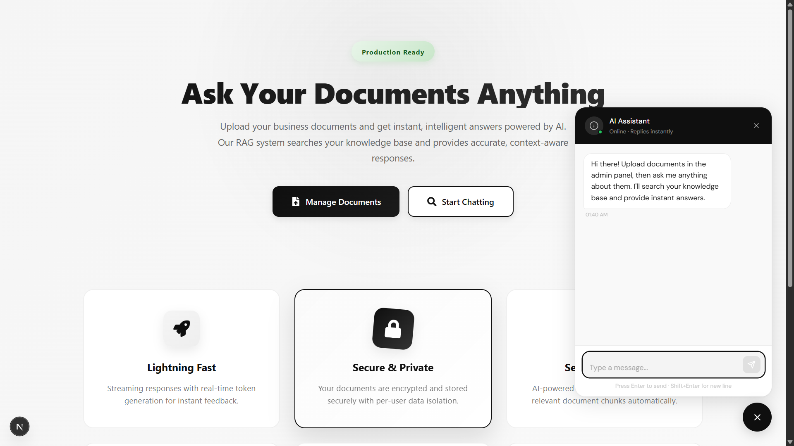

# AI Business Chatbot

A full-stack RAG chatbot that lets users upload documents and get instant, AI-powered answers. Built with Next.js, Supabase (pgvector), and OpenAI with streaming responses, authentication, and professional UI.

## Screenshot



## Key Features

- **RAG Chat** - Semantic search across documents + AI-generated answers
- **Document Management** - Upload PDF/CSV/TXT files, view and delete chunks
- **User Authentication** - Email/password login with Supabase Auth
- **Per-user Data Isolation** - Each user only sees their documents
- **Streaming Responses** - Real-time token-by-token chat output
- **Rate Limiting** - 20 chat/min, 10 uploads/min per user
- **Professional UI** - Responsive design with animations
- **Vector Search** - Semantic similarity via pgvector

## Tech Stack

- **Frontend**: Next.js 16, React 19, TypeScript, Tailwind CSS
- **Backend**: Node.js, Supabase Auth
- **Database**: PostgreSQL + pgvector (vector similarity search)
- **AI/ML**: OpenAI (GPT-4o-mini for chat, text-embedding-3-small for embeddings)
- **File Processing**: PDF, CSV, TXT parsing with intelligent chunking

## Quick Start

1. **Clone and install:**
   ```bash
   git clone <repo>
   cd ai-chatbot
   npm install
   ```

2. **Configure environment:**
   ```bash
   cp .env.local.example .env.local
   ```
   Add your keys:
   - `NEXT_PUBLIC_SUPABASE_URL`
   - `NEXT_PUBLIC_SUPABASE_ANON_KEY`
   - `SUPABASE_SERVICE_ROLE_KEY`
   - `OPENAI_API_KEY`

3. **Run locally:**
   ```bash
   npm run dev
   # Open http://localhost:3000
   ```

For detailed setup with Supabase configuration, see [QUICKSTART.md](./QUICKSTART.md).

## How It Works

1. **Document Ingestion** → Files chunked & embedded with OpenAI
2. **Semantic Search** → User query searches pgvector database
3. **Answer Generation** → Top 5 chunks sent to GPT-4o-mini with query
4. **Stream Response** → Real-time token output to user

## API Endpoints

```
POST   /api/chat              Stream chat with RAG context
POST   /api/ingest            Upload & embed document
GET    /api/documents         List user documents
DELETE /api/documents/[id]    Delete document chunk
GET    /api/chat-history      Get conversation history
DELETE /api/chat-history      Clear history
```

## Deploy to Vercel

1. Push to GitHub
2. Connect repo to Vercel
3. Add environment variables
4. Deploy!

## License

MIT License - Free for commercial use. See [LICENSE](./LICENSE) for details.

## Contact

Questions? Reach out to marwaneboulahya@gmail.com
